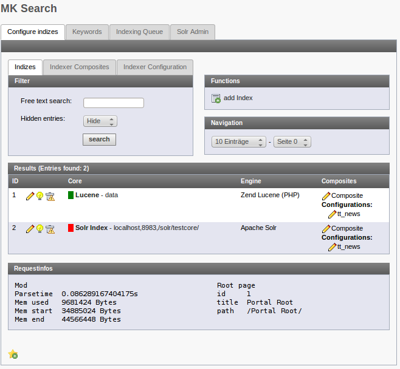

.. ==================================================
.. FOR YOUR INFORMATION
.. --------------------------------------------------
.. -*- coding: utf-8 -*- with BOM.

.. ==================================================
.. DEFINE SOME TEXTROLES
.. --------------------------------------------------
.. role::   underline
.. role::   typoscript(code)
.. role::   ts(typoscript)
   :class:  typoscript
.. role::   php(code)

Screenshots
^^^^^^^^^^^

Blick auf das Backend-Modul von mksearch. Im Beispiel sind Indizes für Solr und für Lucene eingerichtet.
