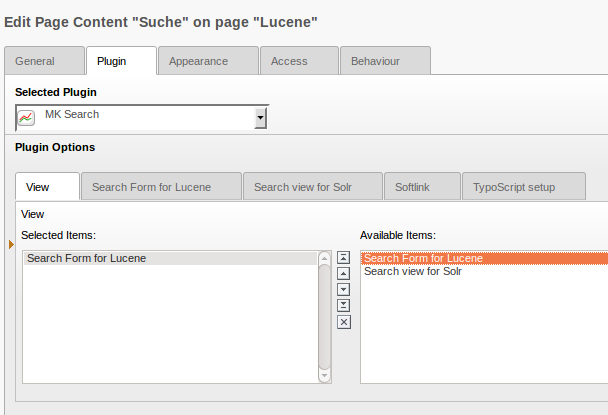

.. ==================================================
.. FOR YOUR INFORMATION
.. --------------------------------------------------
.. -*- coding: utf-8 -*- with BOM.

.. ==================================================
.. DEFINE SOME TEXTROLES
.. --------------------------------------------------
.. role::   underline
.. role::   typoscript(code)
.. role::   ts(typoscript)
   :class:  typoscript
.. role::   php(code)

Anlegen und Einrichten des Plugins
^^^^^^^^^^^^^^^^^^^^^^^^^^^^^^^^^^

Für jede Suchmaschine wird im FE-Plugin ein eigener View bereitgestellt.

Die Extension mksearch stellt ein Frontent-Plugin für die Suchmaske und die Ausgabe der Ergebnisse bereit. Die Ausführung ist aber speziell für die einzelnen Suchmaschinen implementiert, so dass die Möglichkeiten der Suchmaschinen optimal ausgenutzt werden können. Wenn man also ein Plugin einrichtet, muss man sich zunächst die verwendete Suchmaschine aussuchen. Anschließend setzt man die weiteren Einstellungen im jeweiligen Tab der Suchmaschine.Es gibt keine getrennten Views für das Suchformular und die
Darstellung der Ergebnisliste. Mksearch arbeitet grundsätzlich nur mit
Ergebnislisten, welche durch konfigurierbare Filter eingeschränkt
werden können. Die Filter wiederum können HTML-Formulare verwenden,
müssen das aber nicht. Vorkonfiguriert sind natürlich Filter, die ein
Suchformular rendern. Ein Filter ist immer eine PHP-Klasse, welche per
Typoscript konfiguriert wird. So ist es sehr leicht möglich auch
eigene Filter zu integrieren.

View für Zend Lucene
""""""""""""""""""""

Für Zend Lucene sind die bisherigen Einstellungen noch recht
überschaubar. Man muss lediglich noch den Index angeben, der verwendet
werden soll. Außerdem können die HTML-Templates angegeben werden. Wenn
die Felder leer bleiben, werden natürlich automatisch die
mitgelieferten Templates genutzt.

In mksearch werden die HTML-Template für die Ausgabe des Suchformulars
und der Ergebnisliste getrennt behandelt. In der Ergebnisliste wird
das Suchformular lediglich als einzelner Marker integriert. Die
Subparts für beide Vorlagen befinden sich in der Datei
EXT:mksearch/templates/searchlucene.html.

View für Apache Solr
""""""""""""""""""""

Die Konfiguration der Suche für Solr hängt entscheidend von den
Einstellungen in der solrconfig.xml ab. Wenn man mit Solr arbeitet,
sollte/muss bspw. für jeden Typ einer Suche ein eigener Request-
Handler angelegt werden.

Es ist unbedingt darauf zu achten den default request-Handler
(name=standard) in den Beispiel solrconfig.xml Dateien in mksearch in
die eigene solrconfig.xml unverändert zu übernehmen. Dieser request-
Handler wird im Backend für das Modul und die Indizierung verwendet.

Folgende Einstellungen können getroffen werden:

**Search Index to use**

Stellen Sie hier den Solr-Index ein, der für die Suche verwendet
werden soll.

**Filter**

Diese Option ist wichtig, wenn Sie einen eigenen Request-Handler
verwenden. Legen Sie dann hier den Typ dieses Request-Handlers fest.

**Request handler**

Geben Sie den Namen des Request-Handlers an, der für die Suche
verwendet werden soll. Wenn dieses Feld leer bleibt, dann sollte der
Wert über TS gesetzt werden. Es ist keinesfalls empfehlenswert den
request-Handler nicht zu konfigurieren!!! In diesem Fall würde der
default request-Handler verwendet werden, welcher in solrconfig.xml
konfiguriert ist. Dieser wird aber im Backend verwendet und sollte
daher nicht verändert werden. Somit ist der default request-Handler
für gewöhnlich nicht für eine Suche geeignet.

**Force Search**

Wenn diese Option gesetzt ist, wird beim ersten Laden der Suche sofort
eine Suchanfrage ohne Parameter abgesetzt. Somit erscheint eine
Ergebnisliste mit allen Treffern.

**Enable Autocomplete/suggest**

Aktivierung des Autocomplete im Eingabefeld der Suchmaske. Beachten
Sie hierzu auch die Hinweise im Abschnitt  **Autocomplete** !

**Include jQuery main / jQuery UI-Core / UI Autosuggest**

Über diese Optionen können Sie regeln, ob die notwendigen JavaScript-
Bibliotheken für den Autosuggest von mksearch eingebunden werden
sollen. Da jQuery in vielen Umgebungen bereits verhanden ist, kann
somit eine doppelte Einbindung vermieden werden.

**Debug Filter query**

Wenn diese Option gesetzt ist, werden im Frontend ausführliche Daten
über die Solr-Anfrage und das gelieferte Ergebnis angezeigt. Dies ist
oft hilfreich, wenn Solr nicht die erwarteten Ergebnisse liefert.
Nutzen Sie in diesen Fällen die angezeigte Request-URL als
Ausgangspunkt für die Analyse im Solr-AdminPanel.

**Filter class**

Die Filterklasse steuert den Zugriff auf Solr. Die voreingestellte
Klasse sollte für alle normalen Anwendungsfälle ausreichend sein.
Dieser Filter unterstützt Suchanfragen mit und ohne Suchformular.

**Main marker class**

Diese Klasse bereitet die Ergebnisse von Solr für die Darstellung im
Frontend auf. Die eingestellte Klasse sollte nicht geändert werden.

**Subpart for search formular**

Das mitgelieferte HTML-Template für das Suchformular enthält drei
verschiedene Varianten des Formulars. Mit diesem Parameter können Sie
die gewünschte Form einstellen. Mitgeliefert werden folgende Subparts:

- ###SIMPLE###

- ###HEAD###

- ###FORM###

Probieren Sie die einzelnen Formulare einfach mal aus. Natürlich
können Sie auf diesen Weg auch eigene Suchformulare anlegen, ohne die
vorhandenen Vorlagen zu verändern.

**Template for search formular**

Festlegung einer eigenen HTML-Vorlagedatei für das Suchformular.

**Subpart for result list**

Für die Ergebnisliste können Sie ebenfalls in einer HTML-Datei mehrere
Varianten in verschiedenen Subparts anlegen. Der gewünschte Subpart
kann dann hier eingetragen werden. Mitgeliefert wird der Subpart
###SEARCH###.

**Template for result list**

Festlegung einer eigenen HTML-Vorlagedatei für die Ergebnisliste.

View für ElasticSearch
""""""""""""""""""""""

Die Konfiguration der Suche für ElasticSearch erfoltg nicht nur über das
Plugin sondern kann auch direkt in ElasticSearch vorgenommen werden.

Folgende Einstellungen können getroffen werden:

**Search Index to use**

Stellen Sie hier den ElasticSearch-Index ein, der für die Suche verwendet
werden soll.

**Debug Filter query**

Wenn diese Option gesetzt ist, werden im Frontend ausführliche Daten
über die Such-Anfrage und das gelieferte Ergebnis angezeigt. Dies ist
oft hilfreich, wenn ElasticSearch nicht die erwarteten Ergebnisse liefert.

**Template for search formular**

Festlegung einer eigenen HTML-Vorlagedatei für das Suchformular.

**Subpart for result list**

Für die Ergebnisliste können Sie ebenfalls in einer HTML-Datei mehrere
Varianten in verschiedenen Subparts anlegen. Der gewünschte Subpart
kann dann hier eingetragen werden. Mitgeliefert wird der Subpart
###SEARCH###.

**Force Search**

Wenn diese Option gesetzt ist, wird beim ersten Laden der Suche sofort
eine Suchanfrage ohne Parameter abgesetzt. Somit erscheint eine
Ergebnisliste mit allen Treffern.
