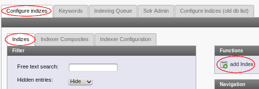
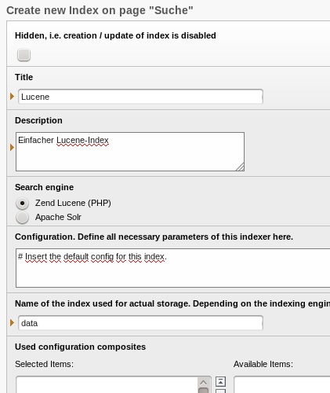
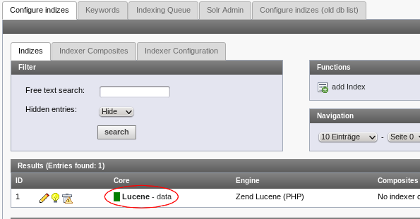
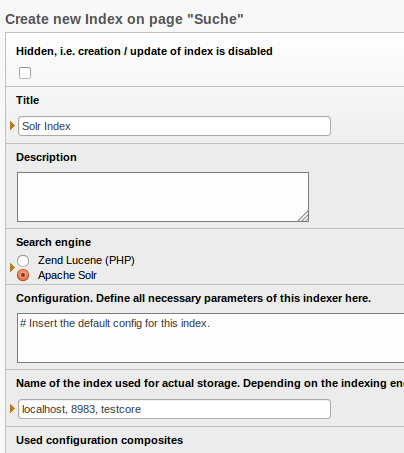
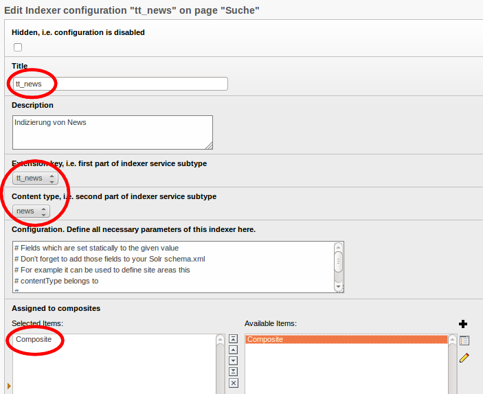
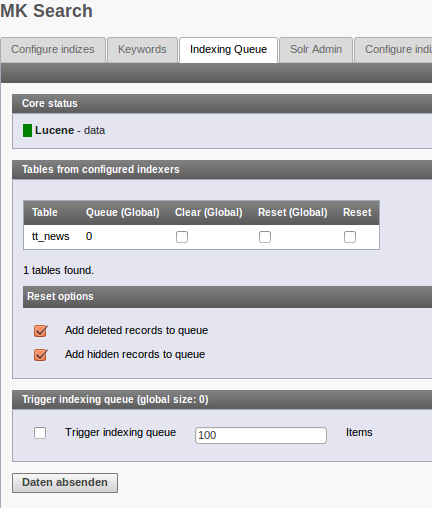

.. ==================================================
.. FOR YOUR INFORMATION
.. --------------------------------------------------
.. -*- coding: utf-8 -*- with BOM.

.. ==================================================
.. DEFINE SOME TEXTROLES
.. --------------------------------------------------
.. role::   underline
.. role::   typoscript(code)
.. role::   ts(typoscript)
   :class:  typoscript
.. role::   php(code)

Einrichtung eines Index
^^^^^^^^^^^^^^^^^^^^^^^

Der erste Schritt nach der Installation der Extension ist die
Einrichtung und Konfiguration der Indizes. Damit legt man fest, welche
Daten wohin gespeichert werden sollen. Ein Index ist letztendlich
nichts anderes, als eine Datenbank. Und diese Datenbank muss zunächst
mit den relevanten Daten gefüllt werden.

Mit mksearch kann man sehr feingranular Regeln für die Indizierung von
Daten bereitstellen. Das beginnt damit, daß für jeden Datentyp ein
sogenannter Indexer bereitsteht. Für diese Indexer kann man Indexer-
Konfigurationen anlegen, um dem Indexer Anweisungen zu geben, wie er
die Daten zu indizieren hat. Man kann für einen Indexer mehrere
Konfigurationen bereitstellen.

Diese Indexer-Konfigurationen werden dann zu einem  **Indexer
Configuration Composite** zusammengefaßt. Diese wiederum ordnet man
dann einem  **Index** zu. Damit steht dann fest, welche Daten auf
welche Weise in einem Index indiziert werden sollen.

Bei kleineren Projekten wird man in der Praxis mit einem  **Index** ,
einem  **Composite** und jeweils einer  **Indexer Configuration** für
jeden Datentyp auskommen.

Besonderheiten bei tt\_content Elementen
""""""""""""""""""""""""""""""""""""""""

Es kann für tt\_content eine allgemeine Konfiguration angegeben
werden, in der festgelegt wird welche tt\_content Elemente indiziert
werden. (abhängig von der Seite, dem Ctype etc.) Allerdings kann in
jedem tt\_content Element nochmal explizit angegeben werden, ob es
indizierbar ist oder ob für diese Entscheidung die Indexer
Konfiguration verwendet wird. Die default Einstellung ist die Indexer
Konfiguration zu verwenden. Diese Auswahl wird im Tab “Erweitert” von
tt\_content Elementen getroffen.

Dies wird z.B. verwendet um nur gewisse Templavoila-Elemente (FCEs) zu
indizieren. In diesem Fall würde man in der Indexer Konfiguration den
Ctype templavoila\_pi1 ignorieren aber in den gewünschten FCEs wählen
diese zu indizieren.

Manchmal kann es sein dass ein Inhaltselement eine versteckte
Überschrift hat. Diese wird von mksearch nicht indiziert. Die
Überschrift soll zwar auf der eigentlichen Seite nicht angezeigt
werden, aber in den Suchergebnissen. Hierfür gibt es einen weiteren
Überschriftentyp (Verborgen (aber via mksearch indiziert)). Wenn
dieser gewählt wird, dann erscheint keine Überschrift auf der
eigentlichen Seite, aber mksearch indiziert die Überschrift womit
diese in den Suchergebnissen ausgegeben werden könnte.

Indizierung von FCEs
""""""""""""""""""""

FCEs können prinzipiell indiziert werden. Allerdings ist darauf zu
achten dass das FCE mit dem gesamten Inhalt indiziert wird. D.h. also
wenn ein FCE Child-Elemente hat, dann solte nur das umgebende FCE
indizierbar sein, nicht aber die Child-Elemente da deren Inhalt
ansonsten mehrfach indiziert wird. Einmal bei dem Element selbst und
einmal bei dem umgebenden FCE.

Anlegen einer kompletten Konfiguration
""""""""""""""""""""""""""""""""""""""

Im folgenden wird die Neuanlage für die Indizierung von
Newsdatensätzen der Extension tt\_news beschrieben.

Einen Index anlegen

Als erster Schritt wird das Modul “Web->MK Search” aufgerufen. Im Tab
“Configure Indizes” wird ein neuer Index angelegt. Vergeben Sie dem
Index einen Titel und eine kurze Beschreibung. Anschließend den Typ
der Suchmaschine auswählen. Nach dieser Auswahl richtet sich der Wert
im Feld “Name of Index”.

**Lucene Index**

Bei Lucene tragen Sie bitte einen eindeutigen Keystring ein und
vermeiden Sie Leer- und Sonderzeichen. Mit diesem String wird im
Lucene-Arbeitsverzeichnis ein neuer Ordner gleichen Namens angelegt.

Basisdaten für einen Lucene-Index. Der Name des Index "data" ist gleichzeigig das Storageverzeichnis auf dem Server.

Der Lucene-Index wurde angelegt und erfolgreich gefunden.

**Solr Index**

Daten für einen Solr-Index. Im Beispiel wird ein lokaler Core mit dem Namen "testcore" konfiguriert.

Bei Apache Solr müssen im Feld für den Indexnamen die Zugriffsdaten im Format
**host,port,core** angebenen werden.
Also zum Beispiel  **localhost,8983,core-name** .
Speichern und schließen Sie den neuen Datensatz. Im Backend-Modul wird
der Index nun mit einer Statusinformation angezeigt. Wenn der Status
grün ist, dann können Sie mit den weiteren Schritten fortfahren.
Andernfalls sollten Sie zunächst das Problem beheben. Wenn Sie die
Maus über das Statusfeld bewegen, erhalten Sie einen Tooltip mit
Hinweisen zum Problem.

**ElasticSearch Index**

Bei ElasticSearch müssen im Feld für den Indexnamen die Zugriffsdaten im Format
**index;host1,port1,core1;host2,port2,core2...** angebenen werden.
Also zum Beispiel  **index-name;server-one,9200,/;server-two,9200,/** .
Speichern und schließen Sie den neuen Datensatz. Im Backend-Modul wird
der Index nun mit einer Statusinformation angezeigt. Wenn der Status
grün ist, dann können Sie mit den weiteren Schritten fortfahren.
Andernfalls sollten Sie zunächst das Problem beheben. Wenn Sie die
Maus über das Statusfeld bewegen, erhalten Sie einen Tooltip mit
Hinweisen zum Problem.

**Ein Indexer-Composite anlegen**

Wir wechseln nun in das Tab  **Indexer Composites** und legen einen
neuen Datensatz an. Vergeben Sie einen Namen und wählen Sie den soeben
angelegten Index aus. Anschließend können Sie speichern und schließen.

Die markierten Bereiche müssen korrekt ausgefüllt werden.

**Einen Indexer für tt_news anlegen**

Im letzten Schritt wird nun ein Indexer angelegt. Wechseln Sie dafür
in das Tab Indexer-Configuration und erstellen Sie einen neuen
Datensatz. Vergeben Sie einen Titel und ggf. Eine kurze Beschreibung
und wählen Sie danach den Extension-Key und den Content-Type aus. Im
Beispiel wird der mitgelieferte Indexer für tt\_news verwendet. Es
werden nur Indexer für Extensions angeboten, welche auch installiert
sind.

Damit sind nun alle Vorbereitungen getroffen, um Newsmeldungen in den
Such-Index zu schreiben.

Wie man sieht, sind diese Zuordnungen sehr flexibel. Man kann auch
problemlos Solr und Lucene gemeinsam verwenden und die selben, oder
natürlich auch unterschiedliche Daten indizieren. In Multi-
Domainumgebungen können für jede Domain eigene Indizes angelegt werden
und somit für eine maximale Trennung der Daten gesorgt werden.

Indizierung von Daten
"""""""""""""""""""""

Über das Backend-Modul kann die Warteschlange überwacht werden.

Die Indizierung der Daten erfolgt grundsätzlich asynchron. Daten, die zur Indizierung anstehen, werden in eine Warteschlange gestellt. Diese Warteschlange für dann von einem Scheduler-Prozess nach und nach abgearbeitet. Auf diese Weise wird die Belastung des Servers auch bei großen Datenmengen gering gehalten. Bei der Erstindizierung dauert es dadurch aber eine Weile bis alle Daten in der Suche verfügbar sind.Wenn es Fehler während der Indizierung gab, dann werden diese in das devlog geschrieben.Über Backend-Modul haben Sie die Möglichkeit die Warteschlange zu
kontrollieren und zu bearbeiten. Wechseln Sie dafür ins Tab Indexing
Queue. Das Modul zeigt nun die von den eingerichteten Indexern
überwachten Tabellen an. Sie haben die Möglichkeit, die einzelnen
Tabellen komplett neu in die Warteschlange zulegen bzw. die Daten auch
wieder aus der Warteschlange zu entfernen.

Am Ende der Seite sehen Sie auch die aktuelle Größe der Warteschlange.
Sie können die Verarbeitung der Daten hier auch manuell anstoßen.

Für die Erstindizierung sollte auf der Tabelle tt\_news ein Reset
durchgeführt werden. Dadurch werden alle vorhandenen Newsdatensätze in
die Warteschlange gelegt. Danach kann man die Abarbeitung entweder
direkt über das BE-Modul anstoßen, oder ein ggf. schon eingerichteter
Scheduler übernimmt die Verarbeitung. Letzteres ist natürlich für den
Livebetrieb unbedingt notwendig.

Im weiteren Verlauf überwacht dann mksearch sämtliche Änderungen an
Daten der zu indizierenden Tabellen. Sobald ein Datensatz geändert,
gelöscht oder neu angelegt wird, wird ein entsprechender Eintrag in
der Warteschlange erstellt. Damit werden alle Änderungen auch zeitnah
in die Suchmaschine übernommen.

Mit der Option  **clear** hat man im Gegenzug die Möglichkeit
Datensätze aus der Warteschlange wieder zu entfernen.

Auf den ersten Blick etwas ungewöhnlich ist die Option gelöschte und
versteckte Datensätze mit in die Warteschlange zu legen. Dies ist aber
notwendig, um mksearch die Möglichkeit zu geben, diese Datensätze auch
aus dem Index zu entfernen.

Probleme bei der Indizierung
""""""""""""""""""""""""""""

Wenn bei der Indizierung von Daten Probleme auftreten, sollte die
Extension devlog installiert werden. Die mksearch schreibt sehr
ausführliche Informationen in das TYPO3-Developerlog. Dieses ist dann
der erste Anlaufpunkt bei der Suche nach einer Lösung.

Datenschema für Solr
""""""""""""""""""""

Im Gegensatz zu Lucene müssen bei Solr die verwendeten Datenfelder im
Vorfeld bekannt gegeben und konfiguriert werden. Dafür verwendet Solr
die Datei schema.xml. Die meisten mitgelieferten Indexer schreiben
ihre Daten in sogenannte Auto-Fields von Solr. Trotzdem werden für
einige grundlegende Informationen spezielle Felder benötigt. Sie
finden eine vorkonfigurierte schema.xml im Verzeichnis
EXT:mksearch/solr/. Auch die weiteren Dateien in diesem Verzeichnis
können für gute Suchergebnisse für Sie interessant sein.

Stellen Sie sicher, daß Solr nach dem Update der Dateien korrekt
startet. Wir empfehlen grundsätzlich die Verwendung des Multi-Core-
Modus von Solr!

Index Konfiguration
"""""""""""""""""""

Für jeden Datentyp, der in der Suche verwendet (gefunden) werden soll, muss eine Index configuration angelegt werden. Der Name ist beliebig wählbar, sollte aber dem Datentyp entsprechen. Danach wählt man über Extension Key und Content Typ den gewünschten Indexer aus. Im Feld Configuration können für den Indexer weitere Konfigurationen per TS bereitgestellt werden. Hier ist die Doku des Indexers zu beachten.

Ein wichtiges Feature der Indexer-Konfiguration ist das zusätzliche Mapping von Datenbankfeldern in Attribute des Ziel-Dokuments. Dies ist im folgenden beispielhaft dargestellt:

.. code-block:: ts

   fieldsMapping {
     entity1 {
       tstamp = sorting_date_dt,lastchange
       dbfield = doc_attr_for_dbfield_s
     }
   }

Die Namen der Entities muss erfährt man aus der Doku des jeweiligen Indexers. Die Datenbankfelder stehen in der Datenbank und die Attribute des Dokuments refenzieren auf das Schema in der Suchmaschine. Im Beispiel sieht man auch, daß man ein Datenbankfeld bei Bedarf in mehrere Attribute schreiben kann.

Mit Version 1.4.35 ist es möglich die Feldwerte nun auch vor der Indexierung zu manipulieren. Konkret kann man derzeit eine Konvertierung des Datums vornehmen. Ausgehend vom Beispiel oben, kann man die Konfiguration mit folgender Angabe erweitern:

.. code-block:: ts

   fieldsConversion {
     sorting_date_dt {
       unix2isodate = 1
       unix2isodate_offset = 0
     }
   }

Damit wird der Wert aus tstamp vor der Übernahme in das Attribut sorting_date_dt in einen String mit dem Format Y-m-d\TH:i:s\Z umgewandelt. Das ist für Solr nützlich, um da mit konkreten Datumswerten arbeiten zu können. Die Angabe von unix2isodate_offset ist optional. Der Default-Wert ist 0.

Indizierung von Dateien (PDFs, Word Dokumenten etc.)
""""""""""""""""""""""""""""""""""""""""""""""""""""

Für die Indizierung von PDFs etc. gibt es verschiedene Möglichkeiten. Das lässt sich direkt mit Solr
bewerkstelligen aber auch direkt in mksearch. Wenn es in mksearch geschehen soll, muss der Pfad zum Tika jar
in der Extensioneinstellung konfiguriert werden (siehe :ref:`extConf`). Außerdem ist Java notwendig. Evtl. muss der Pfad dazu im binSetup
von TYPO3 konfiguriert werden.

Typischerweise wird die Datei in der Tabelle sys_file liegen. Also muss der Indexer für diesen Datentyp (core:file)
eingerichtet werden. Das könnte wie folgt aussehen:

.. code-block:: ts

   # Configuration for indexing mode: tika/solr
   # - tika means local data extraction with tika.jar (Java required on local server!)
   # - solr means data extraction on remote Solr-Server. Binary data is streamed by http.
   indexMode = tika
   # optional array of key value pairs that will be sent with the post (see Solr Cell documentation)
   #solr.indexOptions.params

   # define filters for FAL records. All filters must match to index a record.
   filter.sys_file {
     # a regular expression
     byDirectory = /^fileadmin\/uploads\/.*/
     # commaseparated strings
     byFileExtension = pdf
   }

   # Define which FAL fields to index and to which fields
   fields {
     file_name = file_name_s
     abstract = abstract_s
   }
   # How to map Tika-Fields. Check the manual of Tika which fields exist.
   tikafields {
     # tikafield = indexfield
     content = content
     language = lang_s
     meta.Content-Encoding = encoding_s
     meta.Content-Length = filesize_i
   }

Damit lassen sich dann auch PDF Dateien durchsuchen. Die Ausgabe im FE wird wie üblich konfiguriert.

mksearch bietet aber auch eine Tika Utility, welche anderswertig verwendet werden kann, um den Inhalt von Dateien
zu extrahieren. Die Klasse heißt tx_mksearch_util_Tika.
