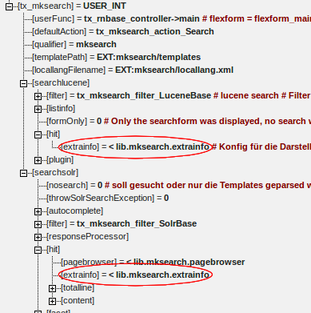
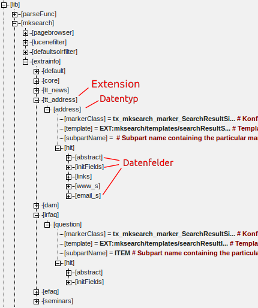

Formatierung der Suchergebnisse
===============================

Die Ausgabe der Suchtreffer ist grundsätzlich bei Solr und Lucene gleich geregelt. Es handelt sich um einen zweistufigen Prozess. Dieser mutet zunächst etwas komplex an, bietet aber maximale Freiheiten bei der Darstellung der Ergebnisse. Des weiteren soll bei der Ausgabe der Zugriff auf die TYPO3-Datenbank vermieden werden. Alle notwendigen Daten sollten direkt aus dem Index kommen. Jeder zusätzliche Datenbankzugriff würde sich negativ auf die Performance auswirken.

Die erste Stufe ist ein allgemeines Template für den Treffer. Hier kann nur auf Marker zugegriffen werden, die in allen Trefferdatensätzen gleich sind.

Die zweite Stufe verzweigt auf den Typ des gefundenen Dokuments. Man kann individuell für jeden Typ eines Treffers ein eigenes HTML-Template bereitstellen. Damit kann man Treffer in den News anders darstellen, als normale Content-Treffer oder als gefundenen PDF-Dateien.

Wenn man doch die Notwendigkeit hat, auf den Datenbank-Record des Treffers zuzugreifen, so hat man per Typoscript die Möglichkeit eine eigene Markerklassen zu registrieren. In dieser kann man dann den notwendigen DB-Zugriff durchführen und die Marker bereitstellen.

Template für Schritt 1 der Ausgabe

    ###SEARCH###
    ###SEARCH_FORM###
    ###SEARCHRESULTS###
      <!-- ###SEARCHRESULTEMPTYLIST### START -->
                            ###LABEL_SEARCH_NORESULTSFOUND###
      <!-- ###SEARCHRESULTEMPTYLIST### END -->

      <ol>
            ###SEARCHRESULT###
                   <li id="searchresult-###SEARCHRESULT_TOTALLINE###">
              <h2 class="searchResultTitle">###SEARCHRESULT_TITLE###</h2>
                    ###SEARCHRESULT_ABSTRACT###
                    ###SEARCHRESULT_EXTRAINFO###
              </li>
            ###SEARCHRESULT###
           </ol>
    ###LABEL_search_foundresults### ###SEARCHRESULTCOUNT###
    
###PLUGIN_DCSEARCHTERM###

    <!-- ###PAGEBROWSER### START -->
    ...
    ###SEARCH###

Diese HTML-Vorlage wird für die Ausgabe der Suchergebnisse genutzt. Der Marker \#\#\#SEARCH\_FORM\#\#\# wird durch die gesamte Such-Maske ersetzt. Die HTML-Vorlage dafür ist also ausgelagert und kann somit einfacher wiederverwendet werden. In den Subpart \#\#\#SEARCHRESULTEMPTYLIST\#\#\# kann man eine Meldung schreiben, die angezeigt wird, wenn keine Treffer gefunden wurden.

Der Marker EXTRAINFO wird per Referenz auf ein lib-Objekt formatiert.

Das lib-Objekt stellt die Konfiguation für jeden Datentyp bereit.

Noch etwasDer Subpart \#\#\#SEARCH\_RESULT\#\#\# gibt einen Treffer-Datensatz aus. In dieser ersten Stufe der Ausgabe sollte maximal auf die Felder TITLE und ABSTRACT zugegriffen werden. In der Praxis hat sich bei den meisten Projekten ergeben, dass in dieser Stufe eigentlich nur der Marker EXTRAINFO verwendet wird. Dieser Marker liefert die Ausgabe der zweiten, der typspezifischen Stufe. Für jeden möglichen Datentyp kann also noch eine spezielle Vorlage angelegt werden. Diese Vorlage wird per Typoscript definiert (siehe Screenshot).

Für Treffer aus der Tabelle tt\_address hat diese Vorlage bspw. folgendes Aussehen:

    <!-- ###TT_ADDRESS_ADDRESS### START -->
    <address>
      ###ITEM_ADDRESS_S### 
      ###ITEM_ZIP_S### ###ITEM_CITY_S### 
       
      ###ITEM_WWW_S### 
            ###ITEM_EMAIL_S###
    </address>
    
###ITEM_SHOWLINK######LABEL_SEARCH_READMORE######ITEM_SHOWLINK###

    <!-- ###TT_ADDRESS_ADDRESS### START -->

Wenn man wissen möchte, welche Attribute überhaupt vorhanden sind, kann sich diese über den speziellen Marker \_\_MINFO\#\#\# ausgeben lassen. Im Beispiel für tt\_address wäre der Marker als \#\#\#ITEM\_\_\_MINFO\#\#\#. Zusätzlich wird damit auch die gefundene Typoscript-Konfiguration für die Marker mit angezeigt.

Bitte beachten Sie im Screenshot des lib-Objektes auch die Konfiguration für “links”. In diesem Abschnitt wird die Zielseite für die Verlinkung des Treffers angegeben.
