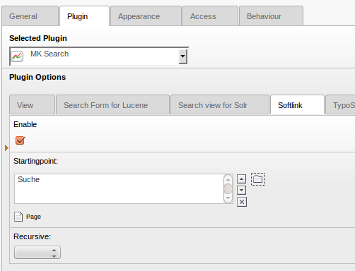

Verwendung von Keywords
=======================

Mit MKsearch Keywords hat man die Möglichkeit bei bestimmten Suchbegriffen, die eigentliche Suche zu umgehen und den Request statt dessen direkt auf eine bestimmte Seite umzuleiten. Man kann natürlich beliebig viele Keywords anlegen. Für die Verwaltung wechseln Sie im BE-Modul in das Tab “Keywords”. Sie können hier neue Keywords anlegen und bestehende Keywords bearbeiten oder entfernen.

Damit die Keywords bei der Suche auch verwendet werden, müssen sie aber im Plugin noch aktiviert werden. Im einfachsten Fall geschieht dies direkt im Plugin. Im Tab Softlink können Sie die Funktion aktivieren und einen SysFolder angeben, in dem die Keywords abgelegt sind.

Alternativ können die Angaben natürlich auch per Typoscript gemacht werden:

    plugin.tx_mksearch.(searchsolr|searchlucene|elasticsearch) {
            softlink.enable = 1
            softlink.options.pidlist = 22
            softlink.options.recursive = 1
    }

Es ist auch möglich einen eigenen Header für den Redirect anzugeben. Das ist besonders interessant, wenn die Suche per Ajax abgeschickt wird. Wird dann der normale Location Header verwendet, kann per JS nicht auf den Redirect reagiert werden, da der Browser diesem direkt folgen würde und den Inhalt des Redirect direkt per Ajax zurückgibt.

    plugin.tx_mksearch.(searchsolr|searchlucene|elasticsearch) {
            softlink.redirectHeaderName = Mksearch_Location
    }
